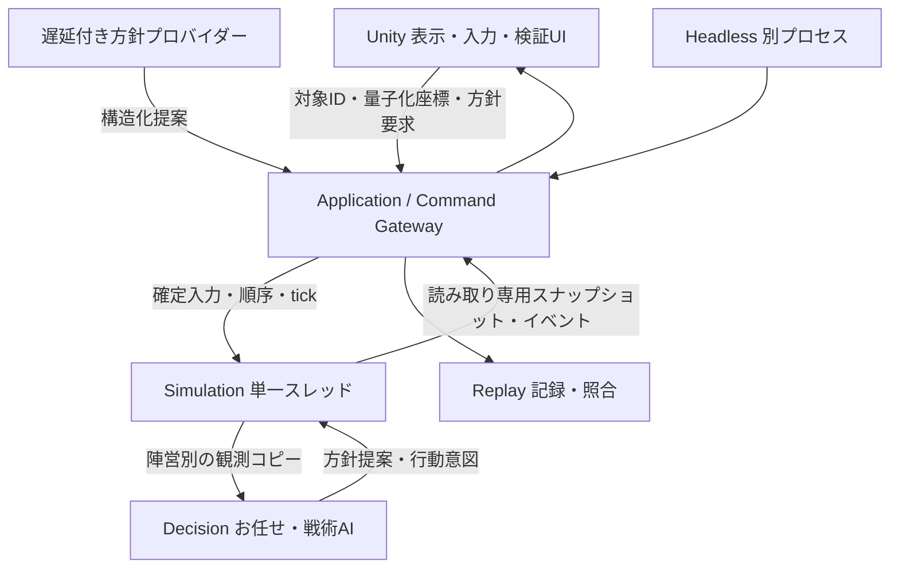

# MVP Ver.1 技術設計書（1〜4週目）

作成日：2026-09-15（公式資料の確認開始は9月14日）。根拠：ルートの「AI指揮型_大規模対戦RTS_企画書.md」、特に3・7・8・11〜13・15・16章。

本書の「確定」は実装契約、「仮設定」は設定ファイルで変更可能な初期値を意味する。仮設定も判断があるまで本書の値で実装する。後述の製品上の未決事項は、この4週間の実装を止めない。今回は設計書のみを成果物とし、以下のプロジェクト、コード、試験データ、実行ファイルは後続の実装発注で作成する。

## 1. 対象範囲と完成条件

1vs1、ローカルの人間対AI／AI対AI、1マップ、歩兵と偵察、固定軍団、2コア・2前線拠点、簡易増援、霧、手動方針、お任せAI、擬似AI遅延、先頭からの再生を実装する。ローカル2人用には同一プロセスで操作陣営を切り替える検証モードを提供する。陣営切替時は画面・選択・報告を消してから対象陣営の情報だけを再構築する。

1週目は10人対10人、3〜4週目は合計40〜80人。100〜500人・数千人の性能保証は対象外で、5週目以降に実測する。DOTS、Jobs、Burst、物理判定、兵士ごとのUpdate、オンライン通信、Steam、実LLM、音声認識、教範検索、試合間メモリ、経済、建築、コア修復、製品用巻き戻しは実装しない。LLM・音声の独立試験は別発注とする。

完成には、同じ入力の全tick一致、2プロセス・開発用2台での照合、非観測敵を使わない判断、古い返答の拒否、介入の時間と代償の可視化を要求する。勝率や少人数の楽しさだけで大軍の成立を判断しない。

## 2. 全体構成・責務・依存方向



図は実行時データフローである。コンパイル依存は以下に固定する。循環参照は禁止。

| アセンブリ | 責務 | 参照可能な自作アセンブリ |
|---|---|---|
| Rts.Contracts | ID、固定小数点、命令、観測、スナップショット、イベントの値型 | なし |
| Rts.Decision | 観測だけを入力にするルールAI、AIメモリの値変換 | Contracts |
| Rts.Simulation | 真の状態、tick、命令競合、移動・戦闘・視界・増援・勝敗 | Contracts, Decision |
| Rts.Replay | 正規バイナリ化、ログI/O、ハッシュ、差分 | Contracts（内部状態は診断DTOで受領） |
| Rts.Application | 入力受付、順序確定、スタブ、シミュレーション実行・再生統括 | Contracts, Simulation, Replay |
| Rts.Presentation | GameObject、UI、カメラ、入力の変換 | Contractsのみ |
| Rts.UnityHost | MonoBehaviourの時計、配線、Applicationと表示の接続 | Application, Presentation, Contracts |
| Rts.Editor / Rts.Tests.EditMode | 設定変換・ビルド／テスト | 必要な上記アセンブリ |

Simulationが真の状態の唯一の所有者。DecisionはSimulationを参照できないため、WorldState、全敵配列、空間索引を受け取れない。Applicationがプロバイダーへ渡せるのも陣営別観測のみ。描画に必要なfloat変換はPresentationで行う。診断用全状態の出口は通常の表示ポートから分離する。

## 3. Unity・フォルダ・参照制約

推奨は **Unity 6.3 LTS（6000.3系）**、Windows x64、仮素材の俯瞰3D、URP。2026-09-14に公式の最新LTS表記と2027年12月までのサポートを確認した。厳密な最新パッチ番号、導入PCでのURP・Test Frameworkの組合せは未確認である。1日目にHubで選択した6000.3の安定パッチと同梱対応パッケージを両者で固定し、ProjectVersion.txtとpackages-lock.jsonに記録する。4週間中の更新は不具合対応時のみ、全再生試験を伴う。[Unity公式リリースサポート](https://unity.com/releases/unity-6/support)

```text
UnityProject/
  Assets/RTS/
    Contracts/       Rts.Contracts.asmdef
    Decision/        Rts.Decision.asmdef
    Simulation/      Rts.Simulation.asmdef
    Replay/          Rts.Replay.asmdef
    Application/     Rts.Application.asmdef
    Presentation/    Rts.Presentation.asmdef
    UnityHost/       Rts.UnityHost.asmdef
    Editor/          Rts.Editor.asmdef
    Tests/EditMode/  Rts.Tests.EditMode.asmdef
    Scenes/ Prefabs/ Materials/ UI/
    Authoring/       Inspector入力用アセット（起動前に検証・変換）
  Packages/
  ProjectSettings/
Headless/            純C#共有ソースをリンクするSDK形式プロジェクト
TestData/            マップ・初期配置・期待値・確定入力
docs/technical-design.md
```

Contracts〜Applicationは `noEngineReferences: true`、`autoReferenced: false`、`overrideReferences: true`、`precompiledReferences: []`、`allowUnsafeCode: false`。自作参照は表の明示参照のみとする。No Engine ReferencesはUnityEngine/UnityEditorの自動参照を外す機能であり、禁止依存の自動検出まで代替するものではない。[Unity公式asmdef形式](https://docs.unity3d.com/6000.3/Documentation/Manual/assembly-definition-file-format.html)

強制は三重に行う。①asmdefと参照の許可リストをEditModeテストで検査、②生成DLLのAssemblyRefを検査しUnityEngine・UnityEditorおよび禁止アセンブリへの直接・推移依存を拒否、③同一純C#ソースをUnity DLLなしでヘッドレスビルドする。DecisionにはSimulationの参照を追加できないことも検査する。純C#部分では条件付きコンパイルによるUnity実装への切替も禁止する。

純C#は.NET Standard 2.1で扱えるAPIとC# 9以下の構文に限定。Int128、record struct、新しいランタイム固有APIに依存しない。ヘッドレスの実行ホストは.NET 10 LTSを初期選択とし、SDKのインストール確認とglobal.json固定は1日目の作業。共有ライブラリの対象は引き続きnetstandard2.1とし、Unityとの両ビルドで互換性を検証する。.NET 10のLTS区分は公式サポート表で確認済み。[Microsoft公式サポート方針](https://dotnet.microsoft.com/en-us/platform/support/policy/dotnet-core)

## 4. 数値契約：固定小数点

座標平面はX/Z、単位はメートル。`Fix64` は符号付きlongのRaw、値は `Raw / 65536`。符号1・整数47・小数16ビット（本書でQ47.16と呼ぶ）。分解能は約0.00001526 m、格納範囲は−2^47〜2^47−2^-16。実ゲーム座標は0〜1024 m、速度0〜16 m/s、HP・ダメージは非負int、tickは非負longに検証制限する。

| 演算 | 確定仕様 |
|---|---|
| 加減算・整数変換 | checked long。中間加減算もchecked |
| 乗算 | `BigInteger(a.Raw) * b.Raw / 65536` を計算し、範囲検査後longへ |
| 除算 | `BigInteger(a.Raw) * 65536 / b.Raw`。ゼロ除算はFault |
| 丸め | 全除算・設定値の有理数変換はゼロ方向切捨て。負値への右シフトによる代用禁止 |
| 入力設定 | 整数または分子/分母で記述。float/double経由の設定変換禁止 |
| 桁あふれ | 飽和・ラップ禁止。tickをFault終了し診断を出す。勝敗として扱わず、後続tickを実行しない |
| 距離比較 | `dxRaw² + dzRaw²` と `radiusRaw²` をBigIntegerで直接比較、平方根を取らない |
| 平方根 | 非負BigIntegerの整数平方根floor（整数二分探索）。Fixのsqrtはisqrt(raw×65536) |
| 正規化・移動 | 長さRawはceil(sqrt(dxRaw²+dzRaw²))。各軸は `deltaRaw * stepRaw / lengthRaw`。ゼロ長は停止。残距離≤stepなら目的地へ一致 |

BigIntegerは乗除算・距離の中間値のみで、状態に保存しない。80体の正しさを優先し、負荷を測定してから同じ丸めの多倍長実装へ置換できる。最適化時はBigInteger実装を参照オラクルとして差分試験する。

速度は初期化時に `speedRaw / 20` をゼロ方向切捨てして1tick移動量に固定する。斜め移動でも距離を増やさない。極小移動で全軸0となった場合は停止（ワープしない）。本マップのセル到達は半径0.1 m以内を到達として次のセルに進める。三角関数は不要。隊列は世界軸に沿った格子、向き・回転は表示だけで計算する。今後必要なら固定テーブルを版管理し、Math.Sin等を判定へ持ち込まない。

## 5. マップ・ゲーム仮設定とデータ構造

### 5.1 1〜4週目の基準シナリオ

256×128 m、2 m角の128×64セル、セルID=`z*128+x`。全地形形状・コア位置・前線拠点位置は双方既知、敵所有状況・敵HP・兵力は観測対象。北道はz=88〜104、南道はz=24〜40、両端接続路はx=16〜32と224〜240（すべて半開区間）。セル中心がいずれかの道内なら通行可能。他は通行不可。1週目だけ全セル通行可能な設定を用いる。

西／東コア中心は(24,64)/(232,64)、北／南拠点は(128,96)/(128,32)。拠点は中立開始、コアHP=3000、半径4 m。拠点は破壊せず占領のみ。40人設定では各陣営20人（北歩兵8、南歩兵8、予備歩兵2、偵察2）、上限は陣営40人・合計80人。軍団は各陣営4個、編成枠は北16・南16・予備6・偵察2、軍団IDは固定、試合中の合流・分割はしない。

初期位置は西側で北(24,96)、南(24,32)、予備(24,64)、偵察(28,64)を基準とし、兵士はローカル番号iに対して `(i%4, i/4)` mを加算する。東側はxだけ `256-x` として鏡像。20人設定では各側を4/4/1/1とする。初期配置はこの生成結果の全兵士座標・IDを記録し、再生時は生成し直さない。

| 設定 | 初期値・ルール |
|---|---|
| 歩兵 | HP100、速度2 m/s、視界20 m、射程2 m、ダメージ10、攻撃間隔20tick |
| 偵察 | HP40、速度4 m/s、視界32 m、射程2 m、ダメージ2、間隔20tick |
| 拠点・コア視界 | 所有中のみ半径24 m |
| 近接判定 | 兵士中心間≤射程。コアは中心距離≤射程+コア半径 |
| 増援 | コア：100tickごと歩兵1人、拠点：200tickごと歩兵1人 |
| 占領 | 半径8 mに生存歩兵が一方だけいる状態を200tick継続。人数による加速なし |
| 時間上限 | 通常はなし。検証の36000tick到達は「未決着終了」で引分け勝敗に数えない |

### 5.2 配列・ID

配列ベースの構造体を採用。IDは種類ごとにuint、0を無効とする。陣営IDは1/2、軍団・拠点・コアは初期定義順に採番、兵士は初期定義順、その後は増援処理順で単調増加。IDを再利用しない。死亡後はAlive=falseの墓石を残す。添字はID−1。兵士配列容量は上限に達したら2倍へ拡張し、配列容量はゲーム状態・ハッシュに含めない。アクティブ人数上限と累積採番数を混同しない。ID枯渇はFault。配列の圧縮・swap removeは禁止。

| データ | 必須フィールド |
|---|---|
| SoldierState | Id, FactionId, ArmyId, Kind, Alive, PositionRawX/Z, Hp, TargetRef, NextAttackTick, MoveGoal, RetreatAnchor, PursuitStartTick |
| ArmyState | Id, FactionId, Role, HomeObjective, 生存ID一覧（昇順）, 現在行動, 方針参照, 経路セル列・カーソル, 開始兵士ID集合, 開始人数・累積損失, AIメモリ |
| OutpostState | Id, Position, Owner（0=中立）, CapturingFaction, CaptureTicks, NextReinforcementTick |
| CoreState | Id, FactionId, Position, Hp, NextReinforcementTick |
| FactionState | Id, AliveCount, Cap, ArmyIds, 方針テーブル, 対象別Revision, 予約・待ち命令, ObservationMemory, ReservePercent |
| WorldState | Tick, Map/Config識別子, 上記配列, NextId群, 入力カーソル, 乱数状態, AI周期, 勝敗/Fault |

Dictionary/HashSetは検索補助だけに利用可。列挙順に意味を持たせず、行動・シリアライズ前にID昇順へ固定する。ランタイムのGetHashCode、オブジェクト参照、壁時計、GUID生成を判定に使わない。

## 6. tick・処理順・同点解決

20 Hz（50 ms）。S0は初期配置と初期視界を計算済みの状態。Step(t)はS(t−1)を読み、Stを確定する。`Time.fixedDeltaTime` やFixedUpdateを判定の時計にしない。UnityHostは非スケール経過時間を積算して必要な回数Stepを呼ぶ。1描画フレーム最大8tick、残りを保持しtickを捨てない。処理落ち時は実時間より進行が遅れる。ポーズ中はtick・スタブも停止、ヘッドレスは無待機で進める。

| 順 | 処理 | 読み取り・確定規則と根拠 |
|---|---|---|
| 1 | 確定入力適用・命令検証 | 予約、取消、提案の受付、適用予定命令。人間介入を当tickのAIより先に反映 |
| 2 | AI | 前tick末の陣営観測と現在方針で判断。方針・軍団配分はt%20=0、戦術は毎tick。意図を全軍分生成してから採用 |
| 3 | 経路・移動 | 旧位置から全移動先を計算、一括反映。Unity衝突を使わない |
| 4 | 攻撃 | 意図の対象について現在の射程・生存・現在視認可否をエンジンが再検証。全攻撃のダメージを蓄積して一括反映 |
| 5 | 死亡・命令結果 | HP≤0を死亡化、開始兵士の損失を更新。相打ちを許す。兵数0等の完了/実行不能を確定 |
| 6 | 拠点占領 | 死者は占領に参加しない。一方のみ存在なら進行。双方存在・誰もいない場合は進捗0、挑戦者が変わっても0から開始 |
| 7 | 増援 | 生存コアと現所有拠点のみ。新兵は当tickに移動・攻撃・占領しない |
| 8 | 視界・観測更新 | 死亡・占領・新兵を反映して次tickのAI入力を生成 |
| 9 | 命令終了・失効、勝敗 | 最新の自軍情報と陣営観測で条件を評価。双方コアHP0なら引分け、一方なら他方勝利 |
| 10 | 出力・状態ハッシュ | Stのスナップショット、可視イベント、正規状態ハッシュを確定 |

命令の適用可否は適用時に再検証する。命令終了条件を満たしたtickでは既に発生した行動を巻き戻さず、次tickから後継方針を用いる。コア撃破後も当tickの両軍攻撃を完了してから勝敗を決める。

全走査は陣営→軍団→兵士ID昇順。同tickの外部入力は `(受信tick, FactionId, 発行者内Sequence)`、Gatewayが連番LogIndexを付ける。同一対象の人間要求は大きいSequenceが最新。同距離・同スコアでは対象種別（兵士、コア、拠点）、IDの順。配分の同点は北→南→予備、経路の同点はセルID。所有陣営に優先権を与えて相打ちを崩す処理は禁止する。

移動は軍団単位の4近傍A*（各辺コスト1、Manhattanヒューリスティック、open順はf→h→セルID、近傍は北・東・南・西）。目標変更時だけ再計算、1回最大8192展開。兵士ごとのA*はしない。目的セルに道がないときは到達可能セルのうち目標への距離→セルID最小を候補とするが、命令の目的を達成できない目標なら実行不能とする。隊列オフセットが道を外れる場合は経路セル中心へ縮める。兵士同士は押し合わず重なりを許す暫定モデルとし、全員が射程条件を満たせば攻撃できる。障害物通過はセル境界で停止する整数グリッド検査を行う。

増援処理順は陣営ID→コア→拠点ID。期日到達時、上限に空きがあれば1人生成、なければ破棄して次回へ（蓄積なし）。割当は発生点をHomeObjectiveに持つ歩兵軍団→予備→残る歩兵軍団ID順、各編成枠に空きがある軍団へ。空きがなければ破棄。出現位置は発生点の通行可能な最近セル中心（距離→セルID）。コア初回はt=100、占領した拠点初回は占領tick+200。占領変更で増援時計をリセットし、放棄許可だけでは所有権も増援も失わない。

## 7. 乱数契約

SplitMix64を採用。状態sをunchecked ulongで `s += 0x9E3779B97F4A7C15`、z=sとして `z=(z^(z>>30))*0xBF58476D1CE4E5B9`、`z=(z^(z>>27))*0x94D049BB133111EB`、結果 `z^(z>>31)`。このPRNG内部だけ2^64の剰余演算を許す。seed=0の最初の出力は `0xE220A8397B1DCDAF` を既知ベクトルにする。

Ver.1通常ルールでは命中、ダメージ、AI同点、推定兵数に乱数を使わない（再現性と傾向の観察を優先）。乱数を使う初期配置の試験生成はシミュレーション外で生成結果まで保存する。WorldStateに予約済みのCombat/AIストリーム状態と呼出回数を保持し、通常は0回であることを検査する。将来追加時はストリームIDと呼出箇所・順をrulesVersionで固定し、表示側乱数は別のインスタンスにする。範囲乱数が必要な試験ではulongの棄却法で剰余バイアスを避ける。

## 8. 方針命令の型と意味

以下はシグネチャのスケッチで、実装本体ではない。宣言順ではなく別途明記する固定数値をwire enum値に採用し、値の再利用は禁止。配列はコンストラクタでコピーし外部へ書換可能な配列参照を返さない。

```csharp
public readonly struct Fix64 { public long Raw { get; } }
public readonly struct SimPoint { public Fix64 X { get; } public Fix64 Z { get; } }
public enum ScopeKind : byte { All = 1, Army = 2, Outpost = 3 }
public enum PolicyKind : byte {
    Focus = 1, AllowAbandon = 2, Retreat = 3, MaintainReserve = 4,
    Defend = 5, Scout = 6, ReturnToAuto = 7
}
public enum CommandSource : byte { Human = 1, Doctrine = 2, Ai = 3 }
public enum CommandStatus : byte {
    Interpreting = 1, Pending = 2, Executing = 3, Completed = 4,
    Cancelled = 5, Expired = 6, Impossible = 7
}
public readonly struct ScopeKey {
    public uint FactionId { get; } public ScopeKind Kind { get; }
    public uint Id { get; } // Allのみ0
}
public readonly struct PolicyVersion {
    public ScopeKey Scope { get; } public ulong Revision { get; }
}
public enum GoalKind : byte { None = 0, Point = 1, Outpost = 2, Core = 3 }
public readonly struct PolicyGoal {
    public GoalKind Kind { get; } public uint Id { get; } public SimPoint Point { get; }
}
public readonly struct LossBudget {
    public ushort Permille { get; } // 0..1000、0=最初から撤退条件成立
}
public enum EndKind : byte {
    UntilReplaced = 1, Arrived = 2, ObjectiveOwned = 3, AtTick = 4, LossReached = 5
}
public readonly struct EndCondition {
    public EndKind Kind { get; } public long Tick { get; }
}
[System.Flags]
public enum ExpireFlags : byte {
    None = 0, SubjectGone = 1, OwnershipChanged = 2, ObservationTooOld = 4
}
public readonly struct Expiration {
    public long ValidUntilTick { get; } // このtickまでは有効
    public int MaxObservationAgeTicks { get; } public ExpireFlags Flags { get; }
}
public sealed class PolicyOrder {
    public ulong CommandId { get; } public ulong BatchId { get; }
    public CommandSource Source { get; } public ScopeKey Target { get; }
    public PolicyKind Kind { get; } public PolicyGoal Goal { get; }
    public byte Priority { get; } // 0..100、同一権限内の配分のみ
    public LossBudget AllowedLoss { get; } public EndCondition End { get; }
    public ushort ReservePermille { get; } // MaintainReserve以外は0
    public ulong TargetRevision { get; }
    public System.Collections.Generic.IReadOnlyList<PolicyVersion> Parents { get; }
    public long ObservedTick { get; } public Expiration Expiration { get; }
}
public enum InputKind : byte { Reserve = 1, Resolve = 2, Cancel = 3, Proposal = 4 }
public sealed class ScheduledInput {
    public ulong LogIndex { get; } public InputKind Kind { get; }
    public long AcceptedTick { get; } public long ApplyTick { get; }
    public ulong RequestId { get; } public ulong IssuerSequence { get; }
    public System.Collections.Generic.IReadOnlyList<PolicyOrder> Orders { get; }
}
public interface IPolicyProvider {
    void Request(PolicyRequest request); // requestは観測・依存版・期限のコピー
    System.Collections.Generic.IReadOnlyList<PolicyReply> Poll(long tick);
}
```

PolicyRequestはRequestId、FactionId、ScopeKey、開始tick、観測DTO、対象・上位版一覧、DeadlineTick、生成するPolicyKind/Goalを持つ。PolicyReplyはRequestId、返却tick、PolicyOrder一覧、成否理由コードを持つ。自由文は説明ログ専用で実行の条件にしない。CommandId/RequestId/BatchIdは試合内単調増加ulong、0は未割当。発行者が番号を自由に確定せずGatewayが採番する。

EndのArrivedは対象軍団の全生存兵が目標半径4 m以内、ObjectiveOwnedは自軍の対象拠点所有、AtTickは当tick以上、LossReachedは下記損失条件。UntilReplacedは自動完了しない。複数条件の任意論理式は対象外。型の未使用フィールドは0、未知enum・範囲外・将来tickの観測・敵軍への命令は拒否する。

手動定型の既定Priorityは50、AllowedLossは300‰、ValidUntilTickはlong.MaxValue、失効フラグはSubjectGone（自軍拠点防衛にはOwnershipChangedも追加）。人間が既知の地形へ出す定型命令には観測年齢制限を課さない。AI提案はObservationTooOldを追加し最大240tick、所有を前提にする提案はOwnershipChangedも必須。観測年齢は受付・適用時の妥当性検査であり、実行後の継続方針を240tickごとに自動失効させるものではない。継続中はValidUntilTickと対象存在・所有前提だけを監視する。解釈要求のDeadlineTickと、実行命令のValidUntilTickは別物とする。

損失は実行開始時の対象生存兵ID集合と人数N0を固定し、その集合の死亡数Dに対して `1000*D >= Permille*N0` で判定。増援を分母にも既存損失の回復にも数えない。N0=0で戦闘命令は実行不能。全軍指示は開始時の軍団ごとに集合を固定し、個別に損失条件で撤退する。全軍の完了は全対象軍団の完了。拠点命令の対象兵は実行開始時にその拠点を担当する軍団の兵で固定する。

### 8.1 対象の重なり・版・人間優先

対象ごとにRevisionを持つ。全軍の版を全命令共通の連番として代用しない。依存は全軍→軍団、全軍→拠点であり、軍団が拠点方針を使った場合のみ当該拠点もParentsへ含める。北の版更新だけでは、北を参照していない南の提案を無効にしない。

全軍は自軍の全軍団、軍団は当該軍団、拠点はHomeObjectiveまたは現在の任務先がその拠点の軍団に影響する。予約時と適用時の両方でこの重なりを評価し、実行開始時に対象軍団リストを固定する。配属が変わった軍団に古い提案を適用しないよう、その軍団の任務版も依存に含める。

優先はゲームルール＞有効な人間明示＞既定教範＞AI。Priorityの数字で権限を越えられない。人間同士で矛盾する同一フィールドは受理順の新しい指示が優先（全軍と軍団でも同じ）。Focusの目標とMaintainReserveの比率など独立フィールドは併存する。従って新しい全軍指示は古い局所指示の矛盾部分を置換し、新しい局所指示は全軍指示への例外となる。置換された古い指示を取消後に復活させない。残る非矛盾制約と既定方針を再合成する。

人間の対象確定時、次の入力tickでReserveを適用し、その対象Revisionを増やして予約する。現在実行中の方針と部隊行動は続くが、重なる古いAI提案は受付・適用の両段階で拒否する。解釈成功Resolveは同じ予約Revisionを使う。取消・失効・完了・実行不能・ReturnToAutoでも対象Revisionを増やし、過去の返答を復活させない。AI/既定教範の受理もその対象Revisionを1増やすが、事前に依存の完全一致を必要とする。

返答のTargetRevisionは「判断時に見た版」であり、受理時に割り当てた実行版を別の確定レコードへ保存する。人間Resolveは予約トークンの版一致を検査する。人間の制約内でのAIの配分変更は可能だが、方針を置換する提案は人間が完了・取消・失効・お任せに戻るまで拒否する。AIにはReserve権限を与えない。

受理時・適用時とも、対象の存在、依存版、予約、観測年齢、所有条件、権限を検証する。敵拠点の所有変化等、非観測事実だけを理由に本人へ失効通知を出してはならない。自軍拠点の喪失は自軍資産情報として即時通知可能。未知の敵コアHPなどを命令拒否理由にしない。

### 8.2 状態遷移

| 現在 | 条件 | 次 | 効果 |
|---|---|---|---|
| 未登録 | 対象を確定・Reserve | 解釈中 | 予約、版更新。定型UIでも同一tick内にResolveまで実施可 |
| 解釈中 | 有効なResolve | 適用待ち | ApplyTick固定、予約維持 |
| 解釈中 | 型不正・対象不明・未対応 | 実行不能 | 理由コード、予約解除 |
| 解釈中 | 締切超過・対象失効 | 失効 | 予約解除、現在方針継続 |
| 解釈中／適用待ち／実行中 | 明示取消・新指示による置換 | 取消 | 待ち適用を除去。損失・位置を戻さない |
| 適用待ち | ApplyTick到達、再検証成功 | 実行中 | 対象・開始人数固定、戦術AIへ |
| 適用待ち | 版不一致・期限切れ・所有前提喪失 | 失効 | 一切適用しない |
| 適用待ち | 経路なし・対象兵数0 | 実行不能 | 一切適用しない |
| 実行中 | 終了条件成立 | 完了 | 優先権解除、版更新 |
| 実行中 | 有効期限・存在条件が失効 | 失効 | 優先権解除 |
| 実行中 | 全滅・目的達成不能 | 実行不能 | 理由を通知、他の有効方針へ |
| 完了／取消／失効／実行不能 | 任意の遅延返信 | 同じ終端状態 | 二重実行禁止、返信破棄を記録 |

AIのProposalは予約なしで検証後に適用待ちとなる。同じtickに複数理由が成立した場合は明示取消→失効→実行不能→完了の順で1回だけ遷移。全滅をArrivedの空集合成立として完了させない。

複数軍団の作戦はBatchIdの全Ordersを同一ApplyTickで事前検証し、**全適用または全不適用**。1件失効なら全体失効、経路不能なら全体実行不能。予約・取消も一括。開始後は軍団ごとの撤退・損失が独立に発生し巻き戻さない。一部実行不能なら他軍団は継続し、バッチを部分失敗としてUI集約（命令状態enum自体は増やさない）。

## 9. 方針とルールAI

### 9.1 Ver.1の方針カタログ

| 種類 | 許可対象／引数 | 戦術・配分への効果／終了 |
|---|---|---|
| Focus 重点変更 | 全軍・軍団、目標拠点/敵コア | 指定目標を配分の第1候補にする。保護中の拠点守備・予備・損失制約は維持。拠点取得で完了、コア目標は試合終了まで |
| AllowAbandon 放棄許可 | 拠点 | 当該拠点の最低守備拘束を解除。有利な他目標への転用を許す。即時所有権破棄や兵士消去はしない。UntilReplaced |
| Retreat 撤退 | 全軍・軍団、帰還地点 | 攻撃・追撃を停止し帰還。被ダメージ無効化なし。自軍コアを既定帰還先、Arrivedで完了 |
| MaintainReserve 予備隊維持 | 全軍、0〜1000‰ | 後方保持人数の下限。軍団単位で切上げ確保、コア防衛圏24 m内の迎撃のみ許可。UntilReplaced |
| Defend 防衛 | 軍団・拠点、対象拠点/自コア | 目標半径8 mに保持、迎撃追撃半径12 m。許容損失到達時は撤退。UntilReplaced |
| Scout 偵察 | 偵察軍団、地点/拠点 | 目標へ接近、敵を視認したら距離12 mを維持する帰還行動へ。敵の現在位置を霧外で追わない。ArrivedまたはAtTick |
| ReturnToAuto お任せに戻す | 全軍・軍団・拠点 | 当該範囲の人間制約・予約・待ちを取消、既定を再合成して即完了。移動・攻撃クールダウンは保持 |

標準許容損失は300‰、遅滞防衛の比較プリセットは500‰。損失閾値到達で元方針の内部段階をReturningへ変え、帰還後に完了とする（End=LossReachedならそのtickで完了し、帰還行動を後継既定として設定）。人間Defend中は人数比が悪いだけの自動撤退で上書きしない。人間の指定した損失閾値と明示撤退のみ撤退理由となる。1000‰指定では全滅まで防衛し得ることをUIに数値表示する。未指定のお任せだけ、後述の劣勢撤退を追加する。

### 9.2 お任せAIの確定ルール

毎20tick、自軍の正確な人数と観測上の推定敵人数で以下の順に配分する。敵人数にHPや隠れた軍団編成を加味しない。既定は予備100‰（改訂前は200‰）。陣営ごとに同じアルゴリズムを独立実行する。

> **改訂（Issue #49）**：改訂前のルールでは、予備の軍団単位切り上げで総兵力の半分以上が予備に拘束され、所有拠点には脅威がなくても守備が固定され、敵コアは「非所有拠点が1つもない」ときしか狙わなかった。その結果、お任せAI同士が20000 tick 経ってもコアに一度も攻撃しなかった（PR #46・#48 の調査）。企画書の「お任せは普通のプレイヤーが普通に考えそうな、まあまあ強い戦い方」「放棄が常に得でも守備が常に得でもない」に合わせ、2〜4を改める。

0. **先に確定するもの**：人間の方針が有効な軍団と、撤退中・帰還後保持中の軍団を先に確定し、配分の対象から除く。残る軍団を1〜4で重複なく配分する。ただし人間のFocusの軍団は全面的には固定せず、守備・予備などの制約を確定した後に4でFocus目標へ向ける（共同攻勢の人数と全体撤退には含めない）。
1. 自コア24 m以内に視認敵がいれば予備を迎撃へ。他軍団は人間制約が許す場合のみ、コアからの経路距離が近い順に戻す。
2. 予備目標人数はceil(生存総数×比率/1000)。偵察を除外し、予備役→コアへの経路が近い軍団→ID順に軍団全体を保持する。確保不能なら不足報告、無理に人間命令を変更しない。**お任せの既定予備に限り、候補ごとに不足人数dを再計算し、候補の生存人数nに対して2d<nならその候補を飛ばして次を調べる（2d=nなら採用）**。小さな不足のために主力軍団を丸ごと拘束しないためである。比率0では予備役も自動保持しない。**人間のMaintainReserveは9.1の下限保証のまま**（不足の許容を適用しない）。
3. 放棄許可のない自軍拠点のうち、**占領脅威がある拠点**へ担当軍団を最低1軍団保持する。候補不足なら人間Priority→拠点ID順に守る。**占領脅威のない所有拠点には守備を固定しない**（その軍団は4の攻勢に回る）。人間のDefendはこの判定に関係なく維持する。
   - **占領脅威**：拠点の半径24 m以内に視認している**敵歩兵**、または**接近中と判定した敵歩兵**（最後の判定から200tick以内）。偵察のみの接触は警戒報告と索敵に使い、最低守備を要求しない
   - **接近**：視認している敵歩兵のうち、その拠点までの経路距離が**60 m以内**で、同じContactIdの直前の視認より経路距離が減ったもの。距離が増えたのを確認したら、その接触の接近判定を解除する。記録は（ContactId, 拠点ID）ごとに直前の視認位置・視認tick・経路距離・最終接近tickを持ち、新しい視認があるときだけ作成・更新する。記録を削除した後の最初の視認は基準の登録だけとし、接近とはしない。不可視中の移動・敵の命令・方向変更は参照しない。期限は最後に接近と判定した観測tickから数える
   - 短期適応の警戒は守備候補の優先順位を上げるが、それ単独では最低守備を要求しない。短期適応も占領脅威（敵歩兵）の観測から更新する
4. 残余のうちFocusが有効な軍団はFocus目標へ。**それ以外の歩兵軍団（偵察を除く）は「攻撃群」として、陣営で1つの攻勢目標を共同で攻める（共同攻勢）**。
   > **改訂（Issue #49、2回目）**：軍団ごとに目標を選ぶ方式では、16人の軍団が1つずつ敵拠点へ向かい、守備16人＋近くの予備に対して劣勢撤退→600tick後に同じ拠点へ再進軍、をくり返して20000tick決着しなかった（お任せ同士の最終状態で確認）。兵力を集めてから攻める方式に改める。
   - **目標の候補**：中立/敵拠点と、**新規に選ぶ時点で自軍が少なくとも1拠点を所有している場合は敵コア**
   - **目標の比較**：「評価領域の推定敵人数×1000÷攻撃群の合計生存人数（整数除算）」→「攻撃群の各軍団から集合地点までの経路距離の最大値」→「種別（拠点、コアの順）」→ID の順で、最も小さいものを選ぶ。**攻撃群が0人なら共同攻勢を休止し、比較しない**
   - **集合地点**：自軍コアから目標まで6章のA*で求めた経路について、目標側から累積の経路距離が初めて40 m以上になる経路セルの中心（経路が40 m未満なら自軍コア側の端のセル）。その地点の半径24 m以内に視認している敵がいれば、経路を自軍コア側へ1セルずつ下げ、視認敵のいない最初のセルとする（観測情報だけで判断する）
   - **評価領域**：攻撃群の各軍団の先頭の生存兵から集合地点までの経路と、集合地点から目標までの経路の**和集合**について、経路セル中心を結ぶ折れ線から24 m以内（端点を含む）。各接触は一度だけ数え、個体接触と集計接触を二重に加えない。推定値は10章の上限値・情報期限に従う。未観測の拠点とコア周辺には同じ警戒仮定（10人）を適用し、観測上の不在と区別する
   - **段階**：
     - **集合**：開始時の攻撃群の軍団を「参加予定」とし、集合地点へ向かわせる。**移動期限**＝参加予定の各軍団の集合地点までの経路距離から移動速度で求めた到着所要tickの最大値＋200tick
     - **集合完了**：参加予定の**全軍団それぞれ**で、生存兵の過半数が集合地点の半径12 m以内にいること。移動期限を過ぎても着かない軍団は参加予定から外し（到着できない軍団を待ち続けない）、残る軍団で判定する。時間の経過だけでは集合完了としない
     - **進撃の判定**（集合完了時と、以降の各配分時）：「集合地点の半径24 m以内にいる攻撃群の生存兵数（兵士単位）×2 ≥ 評価領域の推定敵人数」なら、その時点で集合地点の半径24 m以内に生存兵がいる軍団を**進撃隊**として確定し、進撃へ。満たさなければ集合地点で待つ。**集合完了から600tick**満たさなければ集合失敗とし、目標を除外して選び直す
     - **予備の投入**：進撃の判定を満たせず、**既定予備の軍団**（人間のMaintainReserveではないもの）を加えれば満たせる場合、自コア24 m以内に視認敵がいなければ、その予備軍団を攻撃群に加えて集合地点へ向かわせる。共同攻勢が終わるまで既定予備の再確保の対象から外す。手順1のコア防衛が必要になれば、そちらを優先して戻す
     - **進撃**：進撃隊が目標へ向かう。目標が拠点なら占領半径内に、コアなら射程に入るまで進む
   - **途中で加わる軍団**：守備・予備の解除、増援の割当、予備の投入で攻撃群に加わった軍団は「追加入隊待ち」とし、集合地点へ向かう。集合地点に着いたら次の判定から数える。進撃段階なら集合地点を経由して目標へ向かい、進撃隊に合流した時点で数える。途中参加で期限を延長しない
   - **転用**：進撃隊から1〜3へ軍団を転用した場合は、残る進撃隊で進撃の判定をやり直し、満たさなければ集合地点へ戻って再集合する
   - **維持と解除**：600tickは**最低維持期間**とし、満了後は各配分時に比較する。同じ目標を選んだ場合は段階・集合・損失の状態を初期化しない。目標拠点の自軍取得、到達不能、進撃隊の撤退、人間の命令、集合失敗は**毎tick**評価して次のtickから旧攻勢を止め、新しい目標は次の20tick配分時に0〜3を確定した後に選ぶ
   - **除外**：撤退または集合失敗した目標は、解除したtickから600tick、陣営として候補から外す。全候補が除外中なら、自軍コアに最も近い所有拠点（なければ自軍コア）で待つ
   - 未知の拠点兵力は警戒人数10として評価し、「敵10人を確認」と報告しない
5. お任せの軍団は接敵範囲24 mで**自軍人数×2 < 推定敵上限**の状態が40tick連続、または損失閾値到達で撤退する。
   - **自軍人数**：接敵評価の中心は各軍団の先頭の生存兵とする。その中心から24 m以内にいる、自軍団および同じ進撃隊の生存兵を**兵士単位**で数える
   - **40tickの数え方**：劣勢の継続数は軍団ごとに毎tick更新し、不成立のtickで0に戻す。進撃隊のいずれかの軍団で40tick連続成立したら、そのtickの判定を全軍団分確定した後、**進撃隊全体に同時に**撤退を適用する
   - **損失撤退**：損失閾値に達した軍団は個別に撤退し、残る進撃隊で進撃の判定をやり直す。満たさなければ残る進撃隊も撤退する。攻勢の更新や途中参加で損失の基準をリセットしない
   - 帰還後60tick保持して再配分。人間Retreat完了直後も同じ60tickを設け、即時再進軍を防ぐ

**保存する状態**：次を正規状態とハッシュの対象にする（300行の「メモリに保存するのは観測イベントtickだけ」は短期適応のメモリに限る）。
- 接近判定：（ContactId, 拠点ID）ごとの直前の視認位置・視認tick・経路距離・最終接近tick。接触が接触一覧から消えたとき、または最後の視認から600tick経ったときに削除し、無制限に増やさない
- 共同攻勢（陣営ごと）：攻勢の識別子、目標、段階、集合地点、集合開始tick・移動期限・集合完了tick、維持開始tick、参加予定・追加入隊待ち・進撃隊の区別、予備投入した軍団、除外目標と期限
- 軍団ごと：劣勢の継続数、損失の基準（開始時の兵ID集合）、帰還後保持の期限
集合地点の安全評価・目標の所有状況・敵兵力の評価には、陣営の観測情報だけを使う。

**仮設定と比較値**：予備100‰（比較 0／100／200‰）、占領脅威の記憶200tick（比較 100／200／400）、攻勢目標の維持600tick（比較 200／600／1200）。一要因ずつ変え、改訂前の切上げ方式と新しい不足許容方式は別条件として比べる。コアHP3000・増援周期（コア100／拠点200）・劣勢撤退の条件は、この改訂の効果を確かめてから比較する。

**合格の目安**：お任せが関わる組み合わせは20000tick以内にコア破壊で決着する（両コア同時破壊の引き分けは可、Faultは不可）。維持型同士は未決着を許容する。「初回のコア被弾tick」と「決着tick」は別の指標として記録する。

**共同攻勢の仮設定と比較値**：集合地点40 m手前（比較 24／40／60 m）、集合半径12 m（8／12／16 m）、集合完了の割合は過半数（過半数／75%以上／全員）、移動期限の猶予200tick（100／200／400）、進撃判定の倍率×2（1.5／2／2.5）、最低維持・集合待ち・除外は各600tick（それぞれ200／600／1200、別々に変える）、接近の距離上限60 m（40／60／80 m）。

**記録する指標**：初回のコア被弾tick、決着tick、集合失敗の回数、実際に進撃した人数、守備に拘束された時間、同じ目標への再挑戦の回数、拠点の所有時間。40人対称で膠着した状態からの再開ケースも比較に含める。放棄の有利不利は、集中で突破できる条件と、留守の拠点を取られて増援源を失う条件の両方を同じ初期状態で比べる（決着の速さだけで合格にしない）。

**未決事項（次の調整で判断）**：救援の到着時間と敵の接近時間を比べて守備を続けるかを決める方式。

短期適応は拠点ごとの攻撃開始（その周囲24 mの敵視認が無→有）を記録し、600tick内に2回あれば600tick警戒する。警戒拠点は同点時の守備配分を先にする。消失後60tickは再突入を同じ攻撃と数え、霧の点滅で回数を増やさない。メモリに保存するのは観測イベントtickだけ。

比較する敵プリセットは「維持型」と「集中型」。どちらも同じ仕組みに通常の方針入力で作り、隠れた敵状態で分岐する特別AIは作らない。改訂前の維持型（予備200‰、両拠点保持）は比較用に残す。

- **維持型**：予備100‰。拠点を自軍が所有した時点で、その拠点に人間ソース相当のDefendを通常入力で出す。拠点を失ったらそのDefendは失効し、再取得したら再発行する
- **集中型**：予備0、北Focus、南AllowAbandon。**北Focusが「拠点取得」を理由に完了したのを観測した場合に一度だけ**、北AllowAbandonと敵コアFocusを同時に通常入力で出す。損失撤退による完了・失効・実行不能では2段目を出さない。北Focusの対象範囲とCommandSourceは固定する

### 9.3 戦術AI・追撃

毎tick、撤退段階→人間制約内の任務→射程内の視認兵士→視認コア→経路前進の順に意図を選ぶ。近接攻撃の敵選択は距離二乗→ID。視認が失われた対象IDを即座に攻撃対象から外す。最後に見た場所への探索は許すが、その後の隠れた位置更新は使わない。

追撃開始時の自位置を固定し、12 mまたは60tickで打切り、任務へ戻る。新しいターゲット選択で追撃起点をリセットしない。任務位置に帰還してから次の追撃を許す。撤退中は攻撃せず、歩兵の速度も変えない。偵察は視認敵に対してのみ回避し、見失ったら既定帰還先へ向かう。帰還距離と追撃限界は設定として比較し、撤退の代償を消さない。

## 10. 霧・観測DTO・情報隔離

陣営別にVisibleCells/ExploredCellsのビット配列を持つ。各生存兵・所有拠点・生存コアから、セル中心との距離二乗が視界半径以下のセルを可視とする。4週間では地形の遮蔽・高低差は視界に影響しない。敵は位置セルが可視のときのみ見える。攻撃段階の視認再検証にも移動後の同じ視界関数を使うが、その結果をAIの追加ターゲット探索へ返さない。これにより新規発見への反応は最大1tick遅れる。

```csharp
public sealed class FactionObservation {
    public uint FactionId { get; } public long Tick { get; }
    public System.Collections.Generic.IReadOnlyList<OwnArmyView> OwnArmies { get; }
    public System.Collections.Generic.IReadOnlyList<VisibleEnemy> VisibleEnemies { get; }
    public System.Collections.Generic.IReadOnlyList<EnemyContact> Contacts { get; }
    public System.Collections.Generic.IReadOnlyList<KnownObjective> Objectives { get; }
}
public readonly struct VisibleEnemy {
    public uint ContactId { get; } public SimPoint Position { get; }
    public byte Kind { get; } // HP・隠れた構成員・敵方針を含めない
}
public readonly struct EnemyContact {
    public uint ContactId { get; } public SimPoint LastPosition { get; }
    public long LastSeenTick { get; } public int EstimateMin { get; }
    public int EstimateMax { get; } public bool IsCurrentlyVisible { get; }
}
public interface ITacticalDecision {
    ArmyIntent Decide(FactionObservation observation, OwnArmyView army, PolicyView policy);
}
```

ContactIdは陣営別に初観測順で採番し、内部敵IDへの対応表をSimulationだけが保持する。軍団集計接触も別の連番を割り当て、全軍の敵IDや未観測人数を推測できる番号を公開しない。VisibleEnemyは可視個体のみ。戦術上の射程選択に必要な位置は正確だが、軍団総人数・兵士HPは渡さない。

推定軍団兵数は可視構成員v人から `k=ceil(v/5)`、範囲 `[5*(k−1)+1, 5*k]`、代表値は上限とする。表示は「視認範囲で約N人、軍団総数不明」とし、見えている一部分を軍団総兵力と偽らない。v=0の新規接触は作らない。接触を失ったら位置・推定値・LastSeenTickを凍結し、年齢をtick差で表示。200tick後は不確実表示、600tick後は位置履歴を残し現在兵力をUnknownにする。AIの安全側評価は未知=10人という教範上の仮定と観測値を別フィールドで区別する。

敵死亡はその場が視認可能な場合だけ接触を除去する。非可視中の死亡、増援、方向変更は記憶を書き換えない。最後の位置が再び可視で空なら「その位置に不在」を記録し、全滅とは推定しない。

観測生成時に完全コピーするか、公開メソッドのみの専用不変バッファへ詰める。IReadOnlyListで包むだけで内部の生配列を共有しない。DecisionへWorldState、検索デリゲート、クロージャ経由の全体参照を渡すことも禁止。全状態を持つLockstepの改造対策ではなく、通常コードの情報漏れを防ぐ境界である。

## 11. 擬似AI遅延・命令伝達・判断猶予

スタブはApplication内でtick駆動し、Thread.Sleep、Taskの終了時刻、壁時計乱数を用いない。開始tick Rの観測コピーで提案内容を生成・固定し、`ReadyTick=R+DelayTicks` に返す。遅延は0/60/200/400tick（0/3/10/20秒）。遅延中に最新の戦況で答えを作り直してはならない。通常UIは直接定型命令、検証UIに「解釈待ちを模擬」を用意する。自律提案はAIソース、人間の定型翻訳スタブはHumanソースでReserveを伴う。

仮設定は伝達40tick（2秒）、AI締切240tick（12秒）、観測最大年齢240tick。受付境界の1tickは必要。要求Rに対して `ApplyTick=max(R+40, ReadyTick+1)`。AI処理時間とゲーム内伝達時間は重ね、長い方に合わせる。移動時間はその後に実際の経路移動として発生し、タイマーに含めて省略しない。遅延0/3/10秒なら適用まで40/61/201tick、20秒は締切超過で失効する。DeadlineTick当日の返信は受理可、次tickで未返信要求を失効させる。

20秒応答が有効な場合も比較する専用設定は締切・観測年齢をともに500tickへ変更し、適用401tickを試す。いずれも設定と確定入力を保存する。締切超過の返答はVer.1では必ず破棄し次回へ持ち越さない。手動撤退にも40tickを適用する。取消は操作受付後の次tickで待ち行列を無効化する制御入力であり、新しい移動指示の伝達時間とは区別する。

現方針は待機中も継続。取消後は既定方針または他の有効制約を使い、位置・HP・攻撃待ち・帰還待ちをリセットしない。対象確定のない解釈は予約不可かつ実行不能とする。自律AIは同一対象で未完了要求を1件に制限、依存版が変わったら要求を失効させて次の20tick判断機会に再要求する。

UI時系列に、初観測、報告表示、入力受付、解釈完了、適用、出発、到着、損失、占領変更を記録する。壁時計の描画時刻は分析用の別ログで、決定論状態へ入れない。通信待ちはVer.1では0と明記し、実LLM待ちとLockstepの入力欠落待ちを同じ指標にしない。

判断猶予は固定シナリオの先頭再生で測る。コア防衛＝撃破回避、撤退＝指定軍団の50%以上帰還、増援＝拠点陥落前の防衛到着、陽動対応＝主攻側拠点またはコア維持を成功述語とする。同じ命令の受付tickを1tick刻みで全探索して成功tick集合と最終成功tickを出す（成功が単調とは仮定しない）。初観測から最終成功までを猶予とし、理解・入力時間として追加60tickを入れたケースも比較する。結果なしの場合は「猶予なし」、終了上限まで判定できない場合は「未評価」とする。

## 12. シミュレーションと表示の境界

```csharp
public interface ISimulation {
    void Step(long tick, System.Collections.Generic.IReadOnlyList<ScheduledInput> inputs);
    FactionFrame Capture(uint factionId);
    DiagnosticState CaptureDiagnostic(); // 開発・再生用、通常UIには公開しない
}
public interface ICommandPort { ulong Submit(UserPolicyIntent intent); void Cancel(ulong requestId); }
public interface IFrameSource { FactionFrame Latest(uint factionId); }
public sealed class FactionFrame {
    public long Tick { get; } public uint FactionId { get; }
    public System.Collections.Generic.IReadOnlyList<RenderUnit> Units { get; }
    public FactionObservation Observation { get; }
    public System.Collections.Generic.IReadOnlyList<CommandView> Commands { get; }
    public System.Collections.Generic.IReadOnlyList<GameEvent> Events { get; }
    public FogView Fog { get; } public MatchResult Result { get; }
}
public readonly struct GameEvent {
    public long Tick { get; } public uint Ordinal { get; }
    public EventKind Kind { get; } public byte AudienceMask { get; }
    public uint SubjectId { get; } public ulong CommandId { get; }
    public SimPoint Position { get; } public int Value { get; } public ReasonCode Reason { get; }
}
```

RenderUnitは表示用ID、自軍/接触区分、兵種、固定位置、移動/攻撃/撤退状態だけを持つ。自軍のみHPを含める。CommandViewはID・対象・種類・状態・受付/適用tick・理由を持つ。FogViewは可視/探索済みセルのコピー。EventKindはCommandChanged=1, MoveStarted=2, Attack=3, Death=4, Capture=5, Reinforcement=6, ContactChanged=7, MatchEnded=8, Fault=9。ReasonCodeはNone=0, Superseded=1, UserCancelled=2, Deadline=3, StaleVersion=4, InvalidPayload=5, SubjectGone=6, OwnershipChanged=7, NoPath=8, EmptyArmy=9, ObservationTooOld=10, LossLimit=11。追加はschemaVersionを更新する。

イベントはフェーズ順→対象ID順でOrdinalを当tickの0から採番。AudienceMaskは陣営1=bit0/陣営2=bit1。攻撃・死亡の位置が視認できる陣営と当事者の自軍情報だけに配布し、敵命令・霧中の戦闘音を漏らさない。各FactionFrameには配布済みイベントを接触IDへ変換して入れる。結果イベントだけは双方に公開する。再描画による音の重複は `(tick, ordinal)` で抑止する。

非公開イベントの件数がOrdinalの欠番から漏れないよう、FactionFrameへ詰める際に陣営別Ordinalを0から振り直す。表示の重複抑止はこの陣営別番号を使用する。共有EventHashには内部イベント列、陣営別EventHashには配布後の列を別々に正規化する。

表示はSt−1とStを1tick遅延で補間し、alpha=積算残時間/50msを0〜1にclampする。新規生成はStから出現、死亡/視界消失はStで即非表示、不可視位置を補間しない。停止・追いつき中の余剰時間から外挿しない。アニメーション終了・Transform・Collider・NavMesh・Physics結果は判定へ返さない。

入力だけは例外的な情報流入で、クリックした地面座標を1/256 m格子へ最近丸め（中点はゼロから遠ざける）、NaN/無限・範囲外は拒否し、固定座標または選択IDにする。選択IDは表示オブジェクトの位置から再推定せず、フレームに付随したIDを使う。Gatewayが地形・対象権限を再検証し正規命令として記録する。Presentationには位置setter等のシミュレーション更新APIを提供しない。

検証UIは速度1/2/4倍、ポーズ、1tick送り、陣営視点、遅延設定、方針ボタン、予約/実行状態、時系列、再生ファイル選択を備える。全知表示は診断モードの別配線と常時ラベルを必須とし、比較試験中の操作には使わない。

## 13. 再生形式・ハッシュ・不一致解析・ヘッドレス

### 13.1 記録契約

1試合1個の `.rtsreplay`、独自の非圧縮バイナリv1を採用。整数はlittle endian、boolは0/1の1byte、enumは定義したbyte、Fix64はRawのint64、配列はuint32件数+要素、文字列はuint32 UTF-8 byte長+本文。nullは禁止し未存在は明示bool。ファイルはMagic `RTSRPL01`、uint32 schemaVersion、ヘッダー長、ヘッダー、長さ付きレコード列、終了レコードの順。

ヘッダーはルール版、tickレート、seed、全仮設定、マップ寸法・通行セル・全初期配置、採番初期値、敵プリセット、ビルド識別子を含む。ビルド識別子はGit commit、dirty有無、純C#ソース集合SHA-256、Editor版、実行バックエンド、パッケージlockハッシュ。マップを外部パス参照だけにしない。ファイルの各レコードにkind、tick、LogIndex、payload長、payload SHA-256を持たせ破損位置を検知する。文字列1 MiB・レコード64 MiBを上限として読み込み時検証する。

レコード種別はInput=1、TickHash=2、DiagnosticCheckpoint=3、End=4。Inputには確定方針本体、適用tickに加えReserve/Resolve/Cancel、拒否・締切による解決結果も記録する。**確定方針だけでは解釈中予約やAIの拒否結果を再現できない**ため、同じ結果に影響する制御入力を省略しない。方針提案側の観測tick・依存版も保持する。生の教範、自然文、AI説明、個人メモリは共用ログへ入れない。

再生時はUI・スタブ・自律上位方針提案を停止し、ログの外部確定入力だけを投入する。毎tickの戦術AIと決定論的お任せ配分は再実行する。上位方針の自動Proposalを作るモードではそのProposalも記録し、再生で二重生成しない。Gateway内部のプロバイダー待機キューは再生対象外だが、Simulation内の予約・待ち適用・版は全て再現対象。終了レコードのないファイルは不完全記録とし、最後の完全tickまでのみ診断再生できる。

### 13.2 tick状態ハッシュ

SHA-256を毎tick（S0も含む）計算する。正規状態は固定順：rules/config/mapの内容ハッシュ→tick/結果→次ID→乱数全状態/呼出数→兵士→軍団→拠点→コア→陣営→方針/予約/待ち入力→陣営観測/接触対応→AIメモリ。各配列はID昇順、命令はApplyTick→LogIndex。構造体のメモリダンプやJSON文字列・GetHashCodeは禁止。墓石の位置等を含め、宣言されたフィールドを明示的に書く。

HP、座標だけでなくクールダウン、経路カーソル、占領進捗、増援期日、損失開始集合、追撃起点、依存版、最終確認tick、次ContactId、入力消費位置も含める。未来の挙動を変えうる状態を除外しない。毎tick再構築する空間索引、配列容量、描画補間、性能計測、壁時計、プロバイダーの内部待ちキュー、ファイル読み込みバッファは除外する。除外したキャッシュは正規状態から同一手順で再生成できることをテストする。

ログ全体を先読みした未来入力までハッシュへ混ぜない。入力カーソルは当tickまでに受理されたLogIndexとし、待ち行列は受理済み入力のみ。イベント列は状態とは別に正規化してEventHashもTickHashレコードへ入れ、表示通知のずれも検出する。

### 13.3 最初の差分と実行方法

100tickごとに正規状態の診断チェックポイントを保存する（開発用途、秘密情報を含む）。照合はS0からtickハッシュを順に比較し、欠落tickも不一致とする。最初の不一致tを検出したら両実行を先頭からtまで再実行し、t−1とtの診断状態を出力する。正常終了時の最終ハッシュだけで一致としない。

差分出力はtick、ビルドA/B、直近のLogIndex、最初の異なるフィールドパス（例 `Soldiers[42].NextAttackTick`）、左右の整数/Raw値、関連軍団・命令・乱数状態を含む。Debug再実行では当tickの各フェーズ末ハッシュを取り、最初の異なるフェーズも示す。元の記録プロセスが再実行できない場合は「tは判明、当tickの期待状態は不足」と明記し、最寄りチェックポイントを添付して再収集する。ハッシュから元データを復元できるとは扱わない。

ヘッドレスはUnityを起動しない.NETコンソール。UnityProject内の純C#ソースをリンクし、同じISimulation.Stepを呼ぶ。以下は後続実装するCLIの契約（現在存在するコマンドではない）。

```text
dotnet run --project Headless -- record --scenario TestData/week3.json --out run.rtsreplay --ticks 36000
dotnet run --project Headless -- replay --in run.rtsreplay --hash-out a.hashes --dump-dir diag-a
dotnet run --project Headless -- replay --in run.rtsreplay --hash-out b.hashes --dump-dir diag-b
dotnet run --project Headless -- compare --left a.hashes --right b.hashes --replay run.rtsreplay
```

2つのreplayは別OSプロセスとして起動する。終了コード0=一致/正常、2=状態不一致、3=形式/版不一致、4=Fault。標準再生は異なるrules/schema/ソースハッシュを拒否し、意図的な互換性試験だけ `--allow-build-mismatch` を明示して識別子を残す。1週目からCLI間の照合、4週目はUnity Editor（Mono）・Windows Player（IL2CPP）・CLI間、さらに同じ記録を開発用2台へコピーして比較する。IL2CPPビルド環境の導入を1週目に確認する。

## 14. テスト・検証方針

Unity Test FrameworkのEditModeでGameObjectを作らず純C#テストを実行する。テストasmdefはEditor限定とし、Test Assembliesの参照を設定する。CLIでのEditMode実行は `Unity.exe -batchmode -nographics -projectPath <project> -runTests -testPlatform EditMode -testResults <xml> -logFile <log>`。`-quit` を併用せずテスト完了を待つ。導入したパッケージ版でオプションを再確認する。[公式Test Framework CLI](https://docs.unity3d.com/Packages/com.unity.test-framework@1.4/manual/reference-command-line.html)

| 分類 | 必須ケース／検証する性質 |
|---|---|
| 数値 | 負数丸め、long境界、ゼロ除算、sqrt完全平方/前後、斜め移動長、Raw往復、BigInteger参照との一致 |
| tick戦闘 | 同tick相打ち、両コア破壊引分け、死亡兵の占領除外、新兵の当tick攻撃禁止、射程境界、冷却維持 |
| 増援・占領 | 両軍争奪で停止、途中無人でリセット、所有交代の時計、上限で貯蓄なし、ID非再利用 |
| 命令 | 予約中の旧返答、Pending取消、全軍/局所の新旧、人間vs高Priority AI、北変更で南を維持、依存拠点変更、バッチ全不適用 |
| 損失 | 開始集合固定、増援で半数基準が変わらない、全滅は到着完了でない、人間Defendの撤退境界 |
| 遅延 | 0/60/200/400tick、締切ちょうど/次tick、伝達と重複、期限後の返信破棄、停止中に時間が進まない |
| 霧 | 敵の霧中移動/死亡で観測更新なし、最終時刻固定、不可視の所有変化で通知漏れなし |
| 情報非干渉 | 可視情報が同じで霧中敵だけ異なる2世界を作り、同じAIメモリを入力して意図・報告が一致。実際の戦闘結果の一致は要求しない |
| 再生 | S0を含む全tick、予約ログ欠落で差分検知、破損/未知版拒否、最初の差分フィールド、キャッシュ再構築、PRNG既知ベクトル |
| 依存 | noEngineReferences、AssemblyRef許可リスト、Decision→Simulation禁止、純C#単独ビルド |

決定論テストは固定シナリオ＋入力列で独立したSimulationを2個作り、36000tickすべてのStateHash/EventHashを比較する。片方は1tickずつ、他方は描画を模した1/3/8tick単位で進め、同じ境界の入力を渡す。初期列挙の順序を乱してから正規化する試験も用意する。同じインスタンスのResetだけに依存しない。既知期待値（移動距離、死亡tick、占領tick）を併用し、2実装が同じ誤りを持つだけの一致を合格にしない。

単一プロセスのテストで保証を完了とせず、13章の別プロセス照合をCI/両者の完了チェックに含める。実行環境、seed、rulesVersion、失敗入力を保存する。表示の補間・選択・霧マスク・音漏れはUnityで手動シナリオを実施し、数値試験で代替しない。

4週目の比較は同じ初期状態×敵2種×介入3種（完全お任せ／開始時のみ／途中変更）×遅延4種。各試験で結果、兵力推移、失った拠点の増援機会、移動時間、最終成功受付tickを記録する。戦術上の優劣が常に同一なら調整課題として残す。80体でtick計算p95<25msを仮の余裕目標とし、PC仕様・Debug/Release・記録I/O時間を分けて測る。未達でもDOTSへ即移行せず探索・敵検索・視界・描画を個別計測する。

## 15. 共通契約・担当分担・4週間の発注単位

最初の合意物はContractsの型・enum値、座標/単位/丸め、S0とtick境界、命令の版・重なり、配列所有権、FactionFrame/Event/Audience、エラー理由、ログschema、最初の試験シナリオと期待値である。UI側が独自の命令クラス・Unity Vector3を共有契約へ追加しない。型変更はA/B両者の利用箇所と記録互換性を確認してから一括変更する。

| 担当 | 所有モジュール | 相手への最初の引渡し |
|---|---|---|
| A：シミュレーション・命令・再生 | Contracts原案、Decision、Simulation、Application、Replay、Headless、数値/決定論試験 | S0と10対10の固定Frame、ICommandPortのスタブ、確定入力の例、ハッシュの期待値 |
| B：Unity表示・入力・検証UI | Presentation、UnityHost、Scenes/仮素材、Editor設定変換、入力量子化、時系列・霧UI、表示検証 | モックFrame表示、定型命令送信、ID選択、陣営視点切替 |
| 共同 | Contracts合意、シナリオ調整、2台照合、性能と体験評価 | 各発注に入出力・完了条件・試験手順を添付 |

Codexへの発注単位は以下。Claude Codeのレビューは依存境界、更新順、情報漏れ、再生互換性、試験根拠を必須観点にする。A/Bは共有ファイルの同時編集を避け、Contracts担当変更は相手の利用箇所までレビューする。

| 週 | Aの発注 | Bの発注 | 統合完了条件 |
|---|---|---|---|
| 1 | 数値、tick、10対10、移動攻撃コア、最小命令ログ、CLI再生/毎tickハッシュ/差分 | Unity版固定、モックと実Frame、カメラ・選択・コアHP・定型命令 | 同じ入力の状態/勝敗一致。別プロセス照合をこの週に開始 |
| 2 | 2経路・2拠点、固定軍団、お任せ、重点/放棄/撤退/予備、予約・版・状態機械 | 北南表示、方針入力、7状態と理由、現方針・進路表示 | 北放棄による実際の再配置と代償、バッチ/取消試験 |
| 3 | 40〜80体、視界/観測隔離、偵察・増援、遅延スタブ、古い返答試験 | 霧、推定と確認時刻、遅延・予約表示、増援上限 | 不可視敵に反応しない。全遅延で試合継続、新指示を保護 |
| 4 | 2台・バックエンド照合、差分診断仕上げ、敵2種、猶予探索 | 時系列、比較結果、速度・再生UI、補間・情報漏れ検証 | 全tick一致、介入3種比較、兆候・間に合ったか・代償を説明可能 |

## 16. 未決事項・オーナー判断（推奨案）

| 事項 | 本書の推奨・当面の実装値 | 判断時期／影響 |
|---|---|---|
| 伝達とAI時間の重ね方 | max方式、2秒伝達、12秒締切。20秒成功試験は25秒締切 | 3週目。手動介入の猶予を見て調整 |
| 守備と自動撤退 | 人間は明示損失閾値まで防衛、お任せだけ人数比撤退 | 2週目。意図を尊重できるか評価 |
| コアHP・攻撃・増援 | 本書仮設定、修復なし、同tick双方破壊は引分け | 3〜4週目。全介入に十分な猶予があるか |
| 予備と軍団粒度 | 軍団単位で比率切上げ、分割しない | 2〜4週目。少人数で比率が粗いことをUI表示 |
| 敵推定 | 視認部分の5人幅、総数不明、30秒でUnknown | 3週目。偵察の価値と誤解を確認 |
| 接触・渋滞 | 兵士重なり可、個別射程攻撃。押し合いは追加しない | 4週目。大軍での密集戦は未検証と記録 |
| ビジュアル | 仮素材の俯瞰3D、URP、兵士1人を1表示 | 1週目。素材購入の判断は本発注外 |
| 開発環境 | Unity6.3の同一安定パッチ、.NET10 CLI、Windows x64 | 1日目。具体的パッチ/パッケージ/IL2CPP環境は導入確認が必要 |
| 基準PC・性能合格値 | 開発用2台の遅い方、80体tick p95<25msを仮目標 | 1週目にPC情報を記録、4週目評価 |
| ローカル2人操作 | 検証用陣営切替、製品用同時入力UIは後回し | 2週目。ローカル対戦の運用を確認 |
| 一般公開の情報保護 | Ver.1は通常コードの漏れ防止、改造対策は別設計 | Ver.4前。Lockstep構成変更の可能性 |

技術契約（固定小数点、20Hz、処理順、版管理、ログ・ハッシュ）は本書で確定する。上表は製品の手触り・導入環境の判断であり、値が未定のまま実装者の推測に委ねるものではない。変更した設定は必ず記録へ埋め込み、ルール変更ならrulesVersionを更新する。

## 17. 企画書への指摘

1. 15章のVer.1全体には100〜500体とある一方、週割りでは5週目以降である。本書は依頼どおり1〜4週目の40〜80体までに限定した。4週目の完了を大規模戦闘の検証完了とは呼ばない。
2. 11章はVer.1早期の別プロセス照合を要求し、15章は4週目・Ver.2にも照合を記載している。矛盾として延期せず、1週目に最小照合、4週目に2台・複数バックエンド、Ver.2に接続後の入力照合を拡充すると整理した。
3. 8章の「AIの考える時間を伝達時間に収める」は、処理時間が伝達時間を超える場合の式が未定である。本書はmax方式と締切破棄を採用した。20秒遅延を常に有効化する設計ではなく、標準期限超過と延長設定の双方で検証する。
4. 敵兵力の「推定値」が可視部分か軍団全体かは未定義。本書は未観測構成員数を使わず、視認部分の推定と総数不明を分けた。将来の全軍兵力推定には観測根拠と不確実性の別設計が必要。
5. 命令ログだけの記述では、解釈中予約・取消による旧返答拒否が再現できない。本書はこれらを確定制御入力として追加記録する。教範や説明文を共用ログへ入れることはしない。
6. 4週目に「同じ方針がどんな状況でも最適にはならない」を確認するには戦闘・地形・増援の調整が必要であり、設計だけで保証できない。比較シナリオと成功述語を固定して測定し、未成立なら企画上の調整課題として明記する。
